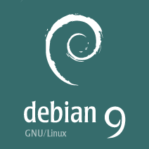

# Debinit 

Configurações iniciais para o Debian 9

## Instalando o _sudo_

[Como instalar o sudo](sudo.md)

## Instalando os _básicos_

[Como instalar os básicos](basicos.md)

## Programas

[Programas](programa/README.md)

## IDEs

[IDEs](ide/README.md)

## Desenvolvimento

[Desenvolvimento](desenvolvimento/README.md)

## Virtualização

[Virtualização](virtualizacao/README.md)

## Banco de dados

[Banco de Dados](banco-de-dados/README.md)

## Temas

[Temas](tema/README.md)
